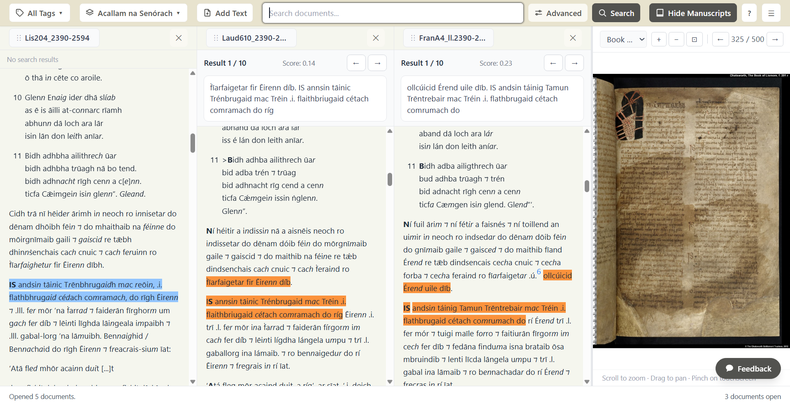
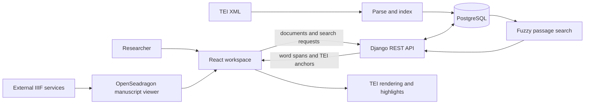
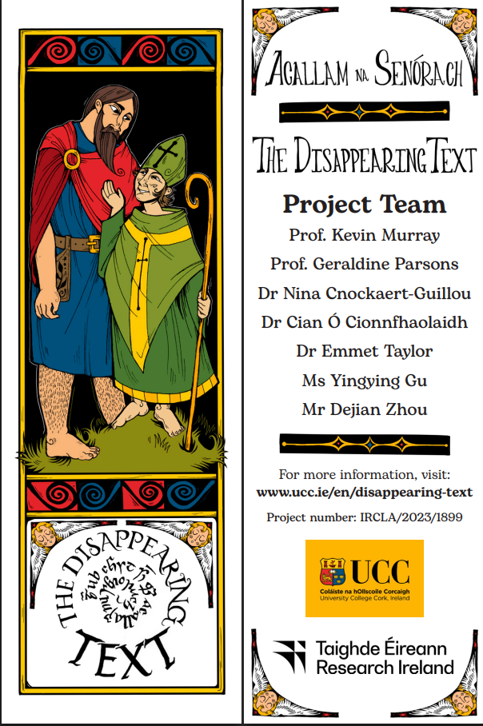

# uCeltic

[](https://github.com/uCeltic/uCeltic/actions/workflows/ci.yml)

**A full-stack research platform for searching and comparing TEI-encoded medieval Irish texts.**

[Live demo](https://82.70.86.16.sslip.io/) · [The Disappearing Text](https://www.ucc.ie/en/disappearing-text/) · [Project updates](https://bsky.app/profile/disappearingtext.bsky.social)



## About

uCeltic gives researchers one workspace in which to read several versions of a
medieval Irish work side by side and search for related passages between them.
It is designed around TEI-encoded scholarly texts, where spelling, wording and
editorial markup can vary between manuscript witnesses.

The platform is developed as part of University College Cork's
[*The Disappearing Text*](https://www.ucc.ie/en/disappearing-text/) project,
funded by Research Ireland. The project is
producing new editions of *Acallam na Senórach* (*The Colloquy of the
Ancients*) and developing software for working with its complex textual
tradition.

## What it does

- Runs configurable **fuzzy passage searches** across every open text, allowing
  for spelling variation and words inserted into or omitted from a passage.
- Opens multiple versions of a work in parallel, with independent scrolling,
  search results and result navigation for each column.
- Parses and renders TEI XML while preserving scholarly conventions such as
  expansions, supplied or deleted text, manuscript locators and editorial
  notes.
- Maps search results back from word indexes to the rendered TEI text for
  precise in-document highlighting.
- Tracks TEI-encoded people and places across the open documents, including
  per-document occurrence counts and navigation.
- Displays manuscript page images from external IIIF services beside the
  transcribed texts.

## How search works

A researcher can type a query or select a passage directly from one open text.
uCeltic searches the other open documents independently and returns the closest
passages in each one. Match length, search precision, dissimilarity threshold
and result count can be adjusted from the workspace.

On upload, the backend parses each TEI document into three related projections:

- a structured tree used by the React TEI renderer;
- a flattened word index used by the search service; and
- stable anchors that map word spans back to elements in the rendered text.

This keeps search independent of XML element boundaries. A word split by inline
editorial markup remains one searchable word, and a returned word span can still
be highlighted at the correct position in the document.

## Architecture



| Layer | Technologies |
| --- | --- |
| Frontend | React 19, TypeScript, Vite, Zustand, Tailwind CSS |
| Backend | Django 6, Django REST Framework, RapidFuzz, lxml |
| Data | PostgreSQL, TEI XML, IIIF |
| Delivery | Docker Compose, Caddy, GitHub Actions, GHCR, systemd |

## Project status

The live application is usable and remains under active development. Its
current corpus is the initial set of researcher-tagged excerpts from the
project's source material. The research team is preparing the complete corpus
while the software continues to evolve.

## Run locally

### Requirements

- Docker Engine with Docker Compose
- Port `80` available locally

### Start the full stack

```bash
cp .env.example .env
```

Set `DB_PASSWORD` and `DJANGO_SUPERUSER_PASSWORD` in `.env`, then generate a
Django secret key. `token_urlsafe` avoids the `$` interpolation issue that
literal dollar signs can cause in Docker Compose environment files.

```bash
python3 -c "import secrets; print(secrets.token_urlsafe(64))"
```

Paste the generated value into `SECRET_KEY`, then start PostgreSQL, Django with
Gunicorn, the built React application and Caddy:

```bash
docker compose up --build
```

Open [http://localhost](http://localhost). A new database contains no texts, so
load the repository's research corpus through Django Admin:

1. Open [http://localhost/admin](http://localhost/admin) and sign in with the
   `DJANGO_SUPERUSER_*` values from `.env`.
2. Under **TEI Documents**, add one or more files from `backend/tei/` and assign
   them to a Work. Each file is parsed and indexed when it is saved.
3. Return to the workspace, open at least two versions and run a search.

Interactive OpenAPI documentation is available at
[http://localhost/api/docs/](http://localhost/api/docs/).

Database data and uploaded files persist in the `pgdata` and `media` Docker
volumes. Stop the stack with:

```bash
docker compose down
```

## Testing

The backend suite uses Django and Django REST Framework tests against
PostgreSQL. With the Compose stack running:

```bash
docker compose exec backend ruff check .
docker compose exec backend coverage run manage.py test
docker compose exec backend coverage report
```

Run the frontend checks locally with Node.js 22:

```bash
cd client
npm ci
npm run lint
npm test
npm run build
```

GitHub Actions runs backend and frontend checks on every pull request and push
to `main`, including linting, migration drift detection, tests, coverage, type
checking and a production-stack smoke test.

## Deployment

The public instance runs on a self-managed VPS behind Caddy. A push to `main`
builds multi-architecture backend and frontend images, tests the assembled
Compose stack, and publishes a blessed `prod` tag to GitHub Container Registry.
A systemd timer on the VPS pulls approved images and runs a post-deployment smoke
check. Caddy serves the application over HTTPS at its `sslip.io` hostname.

See the [CD pipeline](docs/cd-pipeline.md) for the delivery design and the
[VPS runbook](docs/cd-runbook.md) for operational procedures, corpus updates and
rollback.

## Project context



*The Disappearing Text* studies the textual tradition of *Acallam na Senórach*,
a major work of the medieval Irish Finn Cycle. The wider project is preparing
single-manuscript editions, a critical edition and an online multi-layer edition
of the text. Follow the [UCC project website](https://www.ucc.ie/en/disappearing-text/)
and [Bluesky account](https://bsky.app/profile/disappearingtext.bsky.social) for
research news and updates.

uCeltic is developed by **Dejian Zhou** with computer science guidance from
**Dr Enkhbold Nyamsuren** and **Dr Vijayakumar Nanjappan**, in collaboration
with [The Disappearing Text project team](https://www.ucc.ie/en/disappearing-text/outreach/).

## License

Licensed under the [Apache License 2.0](LICENSE).
